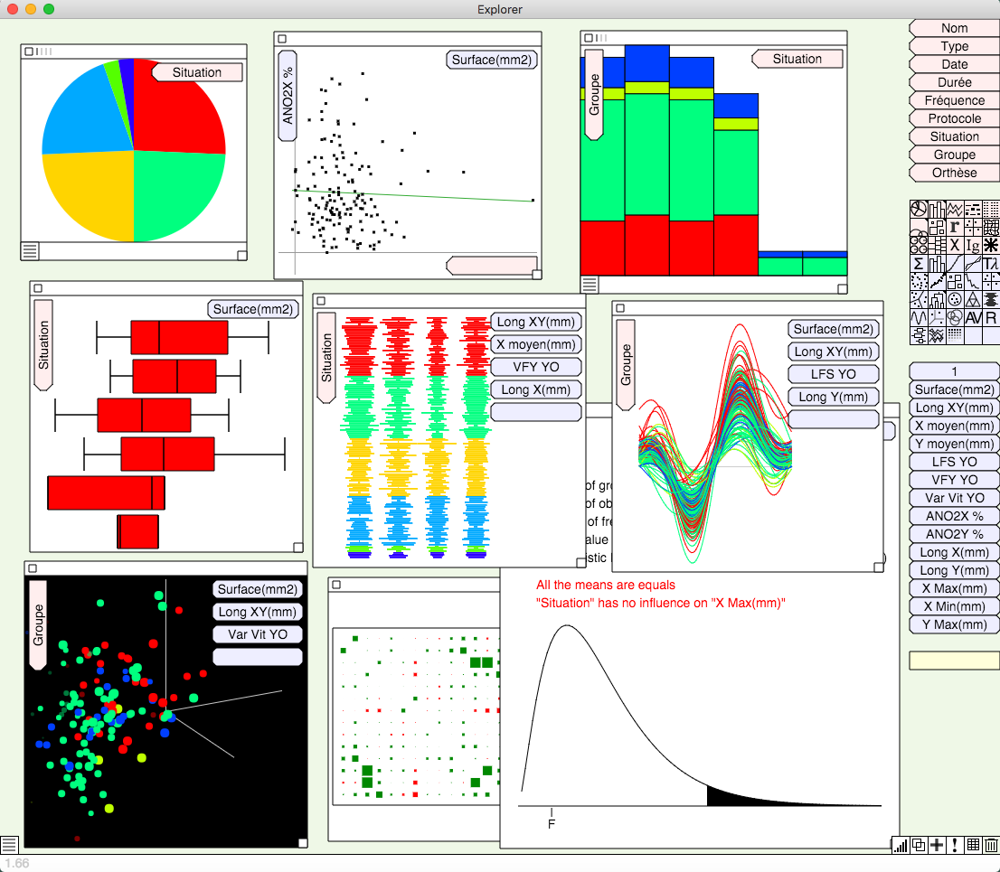
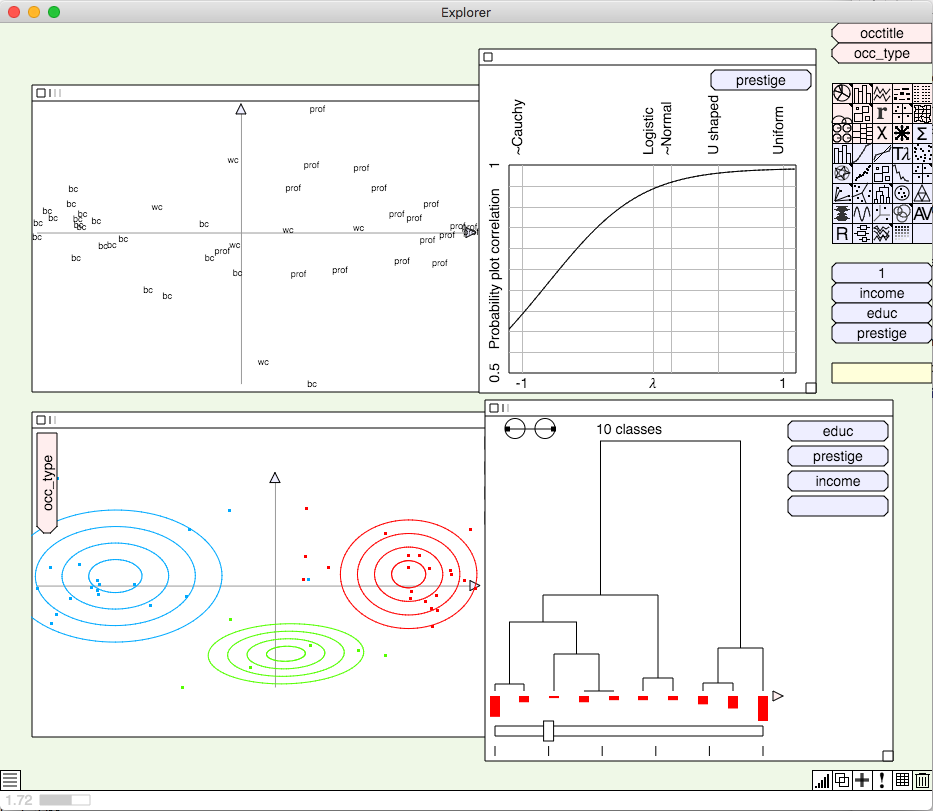
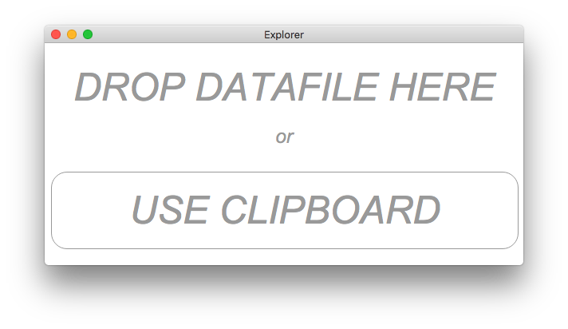
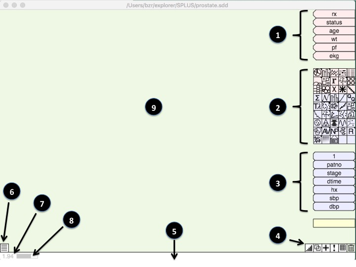

# Presentation

This Explorer allows to perform various statistical analyses and data mining operations in a very easy and intuitive way. As the name implies, this software aims at exploring data and getting quick insight of the order of magnitude of the observed objects. That's why it does focus on graphical representation and mouse driven operations, unlike the traditional statistical tools cluttered with numerous dialog boxes and lists with five decimal figures. You can, however, have the detailed numbers once your analysis is completed.

## Videos

<table>
<tr>
	<td>Overview</td>
	<td align="center">
		<a href="http://www.dailymotion.com/video/x39lwif_data-explorer-demo_tech" title="watch on dailymotion">
			</img>
		</a></td>
	<td align="center"> 
		<a href="https://youtu.be/S0pAdZcNnj4" title="watch on youtube">
			</img>
		</a></td>
</tr>
<tr>
	<td> Contingency table</td>
	<td align="center">
		</td>
	<td align="center">
		<a href="https://www.youtube.com/watch?v=6hUlluoQOd8" title="watch on youtube">
			</img>
		</a></td>
</tr>
</table>

## Screenshots

[Installation and run](#Installation and run)

[Data loading](#Data loading)

[Main window](#Main window)

[Graph](#Graph)

[Tools](#Tools)

[Types of analyses](#Types of analyses)

[In the browser](#In the browser)

[Contact](#Contact)

## Installation and run

The Explorer is written in javascript and built with [electron](http://electron.atom.io),

#### OSX
Download the latest version for darwin from [the release page](https://github.com/jfbouzereau/explorer/releases). 

#### Windows
Download the latest version corresponding to your system (32bit or 64bit) from [the release page](https://github.com/jfbouzereau/explorer/releases). Open the downloaded folder, and run Explorer.exe.

#### Linux
Download [electron](https://github.com/atom/electron/releases) for linux, download the source of the Explorer from [the release page](https://github.com/jfbouzereau/explorer/releases), copy the app folder into electron/resources, then run Electron.

## Data loading

At launch time, the Explorer shows a window to choose the dataset to use. You can either drag and drop a file from your computer desktop, or click the clipboard button.

Various file formats are accepted :

<table border="0">
<tr>
	<th>Source</th>
	<th>File extension</th>
	<th>Remarks</th>
	
</tr>
<tr>
	<td>Access</td>
	<td>mdb , accdb</td>
	<td>Access 2000 or higher</td>
</tr>
<tr>
	<td>dBase</td>
	<td>dbf</td>
	<td></td>
</tr>
<tr>	
	<td>Excel</td>
	<td>xlsx</td>
	<td>The names of the fields are expected at the top of the columns</td>
</tr>
<tr>
	<td>JMP</td>
	<td>jmp</td>
	<td></td>
</tr>
<tr>
	<td>JSON file</td>
	<td>*</td>
	<td>A JSON array of records</td>
</tr>
<tr>
	<td>LIMDEP / NLOGIT</td>
	<td>lpj</td>
	<td></td>
</tr>
<tr>
	<td>MINITAB</td>
	<td>mtw</td>
	<td></td>
</tr>
<tr>
	<td>MLwiN</td>
	<td>ws</td>
	<td>Uncompressed format only</td>
</tr>
<tr>
	<td>Mysql</td>
	<td>*</td>
	<td>A config file with a content like this:

mysql  
host:192.168.0.2  
user:bob  
password:secret  
database:test  
query:select * from mytable  

	</td>
</tr>
<tr>
	<td>Postgres</td>
	<td>*</td>
	<td>A config file with a content like this:

postgres  
host:192.168.0.2  
user:bob  
password:secret  
database:test  
query:select * from mytable  

or: 

postgres  
connection:bob:secret@192.168.0.2/test  
query:select * from mytable  

	</td>
</tr>
<tr>
	<td>R</td>
	<td>rdb</td>
	<td>Binary format only</td>
</tr>
<tr>
	<td>SAS</td>
	<td>sas7bdat</td>	
	<td>Uncompressed format only</td>
</tr>
<tr>
	<td>SPLUS</td>
	<td>sdd</td>
	<td></td>
</tr>
<tr>
	<td>SPSS</td>
	<td>sav</td>
	<td>Uncompressed format only</td>
</tr>
<tr>
	<td>Stata</td>
	<td>dta</td>	
	<td>Stata 8 or higher</td>
</tr>
<tr>	
	<td>Tabular file</td>
	<td>*</td>
	<td>The names of the fields are expected on the first line</td>
</tr>
<tr>
	<td>Web file</td>
	<td>*</td>
	<td>Contains the url of the data. The remote file must be in one of the previous formats</td>
</tr>
</table>

If you click the clipboard button, the data must be in tabular form, with the name of the fields on the first line. 

## Main window

Once the data have been successfully loaded, the main window is displayed :

Here are the elements of the interface :

  1 List of the categorical fields (aka "the pink zone"). By default only 10 fields are displayed. To resize the list, move the mouse just below the list and drag to shrink or extend the list.
  
  2 Icons of the existing analyses (graphs). To run a new analysis, just drag its icon to the workspace.  
  
  3 List of the numerical fields (aka "the blue zone"). By default only 10 fields are displayed. To resize the list, move the mouse just below the list and drag to shrin or extend the list.
  
  4 Icons of the tools
  
  5 Status bar. This area gives at any time details about the object under the mouse, or the action your are about to do.
  
  6 Dock This area is used to keep graphs that are temporarily removed from the workspace.
  
  7 Version number
  
  8 Memory usage
  
  9 Workspace. This area is where the graphs are created and arranged.
  
  
  
## Graph

To create a new graph, drag its icon to the workspace. Alternatively if you dont know which icon to look at, you can right-click or control-click on the workspace to get a menu with all the possible analyses.

A graph is represented by an area with different noticeable parts :

  1 Close box. Click on this box to close the graph. All the computations done will be lost.
  
  2 Option menu. Some graphs have different ways of representing the results. In that case   click on this sign to bring up the menu to choose from. Alternatively, right-click or control-click within the graph.
  
  3 Title bar. This area shows the current selection (see below). Click on this area to drag the graph around. 
  
  4 Slots. These are the places where you can define the parameters of the analysis. In function of the graph, different combinations of slots are shown. On a pink slot you can drag a categorical field. On a blue slot you can drag a numerical slot.
  
  5 Resize box. Click on this box and drag to resize the graph.
  
  
To change the type of a graph, drag the icon of the new type onto the graph. The new analysis will retain the parameters and selection of the previous one.
  
## Tools

Here are the various tools proposed by the toolbar at the bottom of the screen :

* Sort : drag this icon onto a field, or drag a field onto this icon to sort the data in ascending order. Do the same sort again to sort in descending order. The sort is stable : to sort the data by a key consisting of field1,field2,field3,  you must sort by field3 first, then field2, and finally field1.

* Clone. Drag this icon onto a graph to get a copy of it, with the same parameters. If the computation is slow, this allows to bypass the second computation.

* Add : Drag this icon to the pink or blue zone to create a new field. See below.

* Help. Drag this icon onto a graph to get some informations about the analysis, the results produced,  the representation options, and the possible actions.

* Table : Drag this icon to the pink or blue zone to get a table of the values of the dataset.
Drag this icon onto a graph to get a table of the numerical results. They can be copied and pasted into another software.

* Dustbin : Drag this icon onto a field, or drag a field onto this icon to delete the field from the dataset in memory. The original input file is not modified. If the field is in use by any graph, it cannot be deleted.

## Types of analysis
* Pie chart
* Bar chart
* Line chart
* Association diagram
* Word cloud
* Arc diagram
* Contingency table
* Multiple Correspondence analysis
* 3-variable graph
* Treemap
* Chi-2 tests
  * Pearson' chi-square test
  * Yates' chi-square test
  * G-test
  * Fisher's exact test
* Gini impurity
* Entropy
* Repartition curve
* Distribution curve
* Scatter plot
* Ternary plot
* Andrew's curves
* Survey plot
* 3D plot
* Correlations
* Autocorrelation plot
* Probability plot
* Tukey-lambda PPCC plot
* Lag plot
* General statistics
* Normality tests
  * Shapiro-Wilk test
  * Anderson-Darling test
  * Lilliefors test
  * D'Agostino test
  * Anscombe test
  * Omnibus test
  * Jarque-Bera test
* Analysis of variance
  * Bartlett's test
  * F-test
  * Levene test
  * Brown Forsythe test
  * Box's M test
  * Student's T-test
  * Welch T-test
  * Hotelling's test
  * Wilk's lambda
  * Lawley-Hotelling trace
  * Pillai trace
  * Two-way anova
* Non-parametric tests
  * Kolmogorov-Smirnov test
  * Kruskal-Wallis test
  * Jonckheere test
  * Cochran Q test
  * Durbin test
  * Friedman test
  * Mantel-Haenszel test
  * Breslow-Day test
  * Woolf test
* Principal components
* Canonical correlation analysis
* K-means
* K-medoids
* Fuzzy C-means
* Huen diagram
* Dendogram
* Radviz
* Discriminant analysis
* Regressions
  * Linear regression
  * Poisson regression
  * Negative binomial regression
  * Logistic regression
  * Least angle regression
* Influence plot
* QQ plot
* Box plot
* Parallel coordinates

## In the browser

The Explorer can also be executed in any modern browser. Open app/index.html, 
paste the data from the clipboard, and click OK.

## Contact

jfbouzereau&#064;netcourrier.com
